# Sequence diagrams

What happens inside the processes for every call. The [user flows](user-flows.md) show the same calls from the
caller's side.

Participants used throughout:

| Name | What it is |
| --- | --- |
| **Gateway** | `Gateway.API`: YARP + GM.RateLimiting |
| **API** | `Files API`: `FilesController` → GM.Mediator → the command or query handler |
| **DB** | PostgreSQL, through the unit of work |
| **Storage** | `IFileStorageService`: Local, S3 or Azure Blob, wrapped by encryption when it's on |
| **Worker** | `StorageCleanupJob`, `IntegrityCheckJob` and `RetentionJob` on GM.Scheduling |

The bytes (in storage) and the rows (in Postgres) can't share a transaction. Every write is ordered so that any
failure leaves at worst bytes nothing points at, and those are always queued in `storage_cleanups` for the
worker to delete.

**Diagrams in this doc:** [Startup](#startup--sequence) · [Gateway forwarding](#gateway-forwarding--sequence) · [Upload](#upload--sequence) · [Batch upload](#batch-upload--sequence) · [Direct upload](#direct-upload--sequence) · [List](#list--sequence) · [Details](#details--sequence) · [Download](#download--sequence) · [Delete](#delete--sequence) · [Restore](#restore--sequence) · [Presign](#presign--sequence) · [Encryption at rest](#encryption-at-rest--sequence) · [Storage cleanup](#storage-cleanup--sequence) · [Integrity check](#integrity-check--sequence) · [Retention](#retention--sequence) · [Health checks](#health-checks--sequence) · [Swagger via gateway](#swagger-via-gateway--sequence)  
All diagrams: [index](README.md)

## Startup — sequence

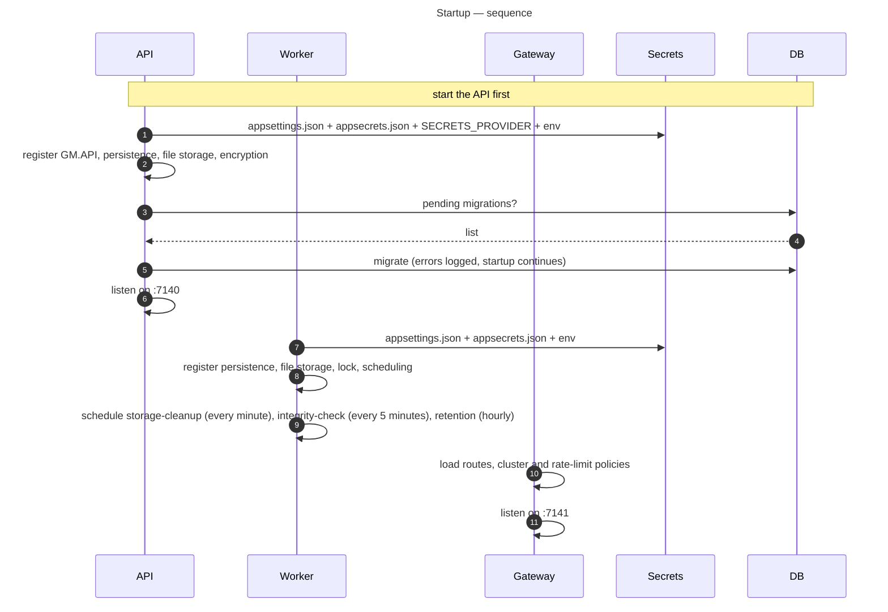
```mermaid
---
title: Startup — sequence
---
sequenceDiagram
    autonumber
    participant API
    participant W as Worker
    participant G as Gateway
    participant Sec as Secrets
    participant DB

    Note over API,DB: start the API first
    API->>Sec: appsettings.json + appsecrets.json + SECRETS_PROVIDER + env
    API->>API: register GM.API, persistence, file storage, encryption
    API->>DB: pending migrations?
    DB-->>API: list
    API->>DB: migrate (errors logged, startup continues)
    API->>API: listen on :7140

    W->>Sec: appsettings.json + appsecrets.json + env
    W->>W: register persistence, file storage, lock, scheduling
    W->>W: schedule storage-cleanup (every minute), integrity-check (every 5 minutes), retention (hourly)

    G->>G: load routes, cluster and rate-limit policies
    G->>G: listen on :7141
```

The worker never migrates. If it starts before the API has created the schema, its first runs fail and are
retried the next minute.

## Gateway forwarding — sequence

Every call below passes this way first; the later diagrams start at the API.

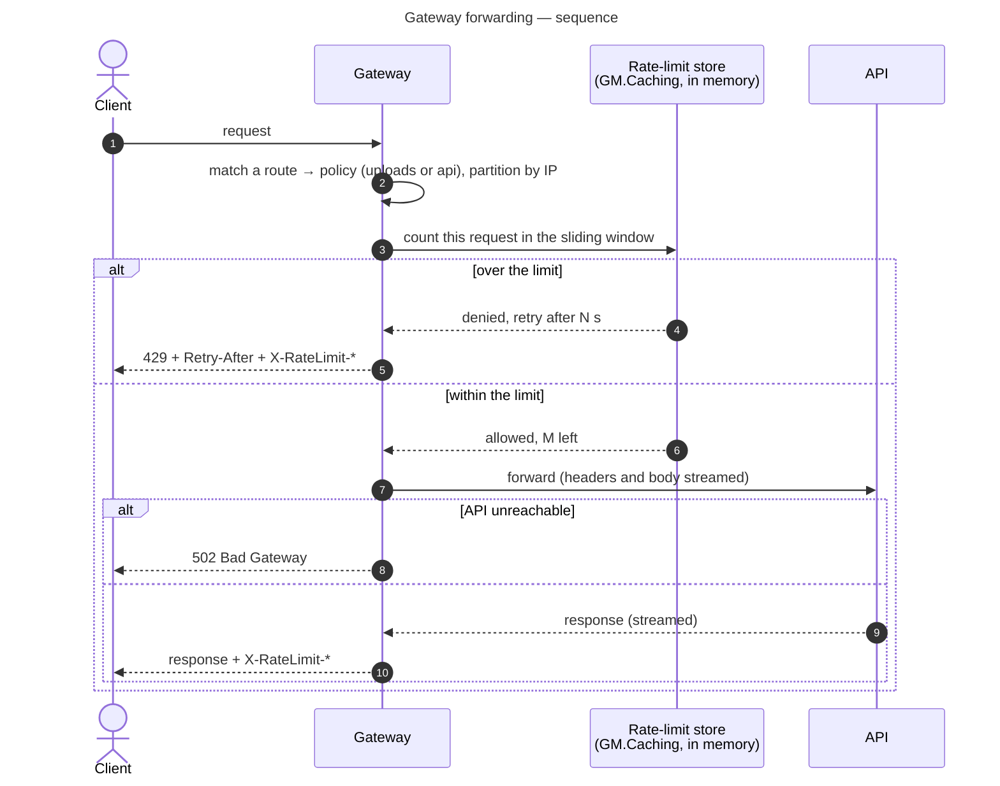
```mermaid
---
title: Gateway forwarding — sequence
---
sequenceDiagram
    autonumber
    actor C as Client
    participant G as Gateway
    participant RL as Rate-limit store<br/>(GM.Caching, in memory)
    participant API

    C->>G: request
    G->>G: match a route → policy (uploads or api), partition by IP
    G->>RL: count this request in the sliding window
    alt over the limit
        RL-->>G: denied, retry after N s
        G-->>C: 429 + Retry-After + X-RateLimit-*
    else within the limit
        RL-->>G: allowed, M left
        G->>API: forward (headers and body streamed)
        alt API unreachable
            G-->>C: 502 Bad Gateway
        else
            API-->>G: response (streamed)
            G-->>C: response + X-RateLimit-*
        end
    end
```

## Upload — sequence

`POST /api/v1/files`

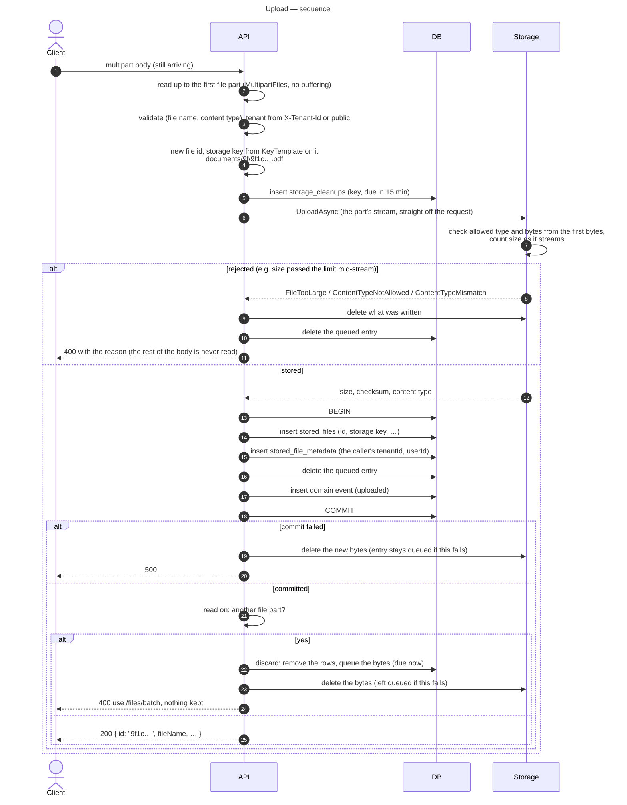
```mermaid
---
title: Upload — sequence
---
sequenceDiagram
    autonumber
    actor C as Client
    participant API
    participant DB
    participant S as Storage

    C->>API: multipart body (still arriving)
    API->>API: read up to the first file part (MultipartFiles, no buffering)
    API->>API: validate (file name, content type), tenant from X-Tenant-Id or public
    API->>API: new file id, storage key from KeyTemplate on it<br/>documents/9f/9f1c….pdf
    API->>DB: insert storage_cleanups (key, due in 15 min)
    API->>S: UploadAsync (the part's stream, straight off the request)
    S->>S: check allowed type and bytes from the first bytes,<br/>count size as it streams
    alt rejected (e.g. size passed the limit mid-stream)
        S-->>API: FileTooLarge / ContentTypeNotAllowed / ContentTypeMismatch
        API->>S: delete what was written
        API->>DB: delete the queued entry
        API-->>C: 400 with the reason (the rest of the body is never read)
    else stored
        S-->>API: size, checksum, content type
        API->>DB: BEGIN
        API->>DB: insert stored_files (id, storage key, …)
        API->>DB: insert stored_file_metadata (the caller's tenantId, userId)
        API->>DB: delete the queued entry
        API->>DB: insert domain event (uploaded)
        API->>DB: COMMIT
        alt commit failed
            API->>S: delete the new bytes (entry stays queued if this fails)
            API-->>C: 500
        else committed
            API->>API: read on: another file part?
            alt yes
                API->>DB: discard: remove the rows, queue the bytes (due now)
                API->>S: delete the bytes (left queued if this fails)
                API-->>C: 400 use /files/batch, nothing kept
            else
                API-->>C: 200 { id: "9f1c…", fileName, … }
            end
        end
    end
```

If the API crashes between the upload and the commit, the bytes exist but nothing points at them. The queued
entry falls due 15 minutes later and the worker deletes them.

Because the file is streamed, a second file part only shows up once the first is stored. Discarding it then, rather
than soft-deleting it, keeps nothing the caller was never told about.

## Batch upload — sequence

`POST /api/v1/files/batch`

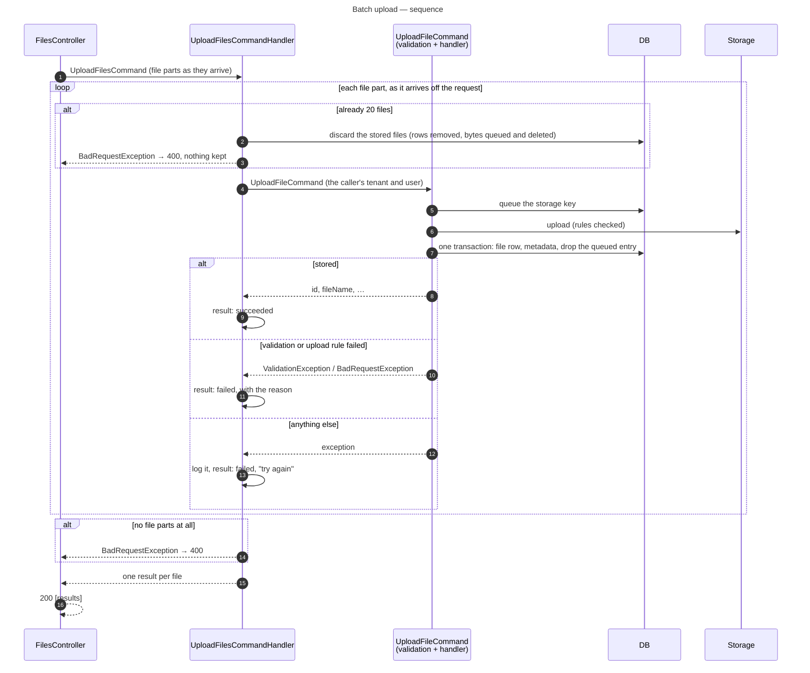
```mermaid
---
title: Batch upload — sequence
---
sequenceDiagram
    autonumber
    participant C as FilesController
    participant B as UploadFilesCommandHandler
    participant U as UploadFileCommand<br/>(validation + handler)
    participant DB
    participant S as Storage

    C->>B: UploadFilesCommand (file parts as they arrive)
    loop each file part, as it arrives off the request
        alt already 20 files
            B->>DB: discard the stored files (rows removed, bytes queued and deleted)
            B-->>C: BadRequestException → 400, nothing kept
        end
        B->>U: UploadFileCommand (the caller's tenant and user)
        U->>DB: queue the storage key
        U->>S: upload (rules checked)
        U->>DB: one transaction: file row, metadata, drop the queued entry
        alt stored
            U-->>B: id, fileName, …
            B->>B: result: succeeded
        else validation or upload rule failed
            U-->>B: ValidationException / BadRequestException
            B->>B: result: failed, with the reason
        else anything else
            U-->>B: exception
            B->>B: log it, result: failed, "try again"
        end
    end
    alt no file parts at all
        B-->>C: BadRequestException → 400
    end
    B-->>C: one result per file
    C-->>C: 200 [results]
```

Every file goes through the full single-file sequence above, in its own transaction, so a failure leaves the files
before and after it untouched. A cancelled request (the client disconnects) stops the batch; the files already
stored stay.

## Direct upload — sequence

`POST /api/v1/files/direct-uploads`, the client's PUT, then `POST …/direct-uploads/{uploadId}/complete`

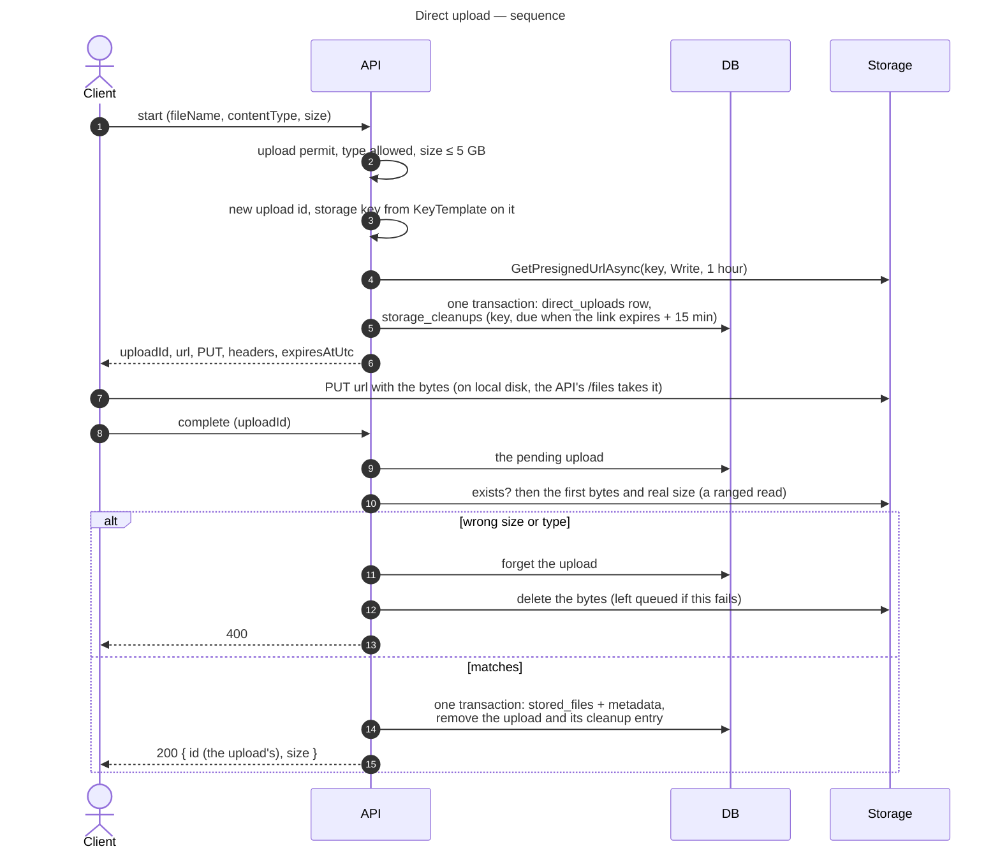
```mermaid
---
title: Direct upload — sequence
---
sequenceDiagram
    autonumber
    actor C as Client
    participant API
    participant DB
    participant S as Storage

    C->>API: start (fileName, contentType, size)
    API->>API: upload permit, type allowed, size ≤ 5 GB
    API->>API: new upload id, storage key from KeyTemplate on it
    API->>S: GetPresignedUrlAsync(key, Write, 1 hour)
    API->>DB: one transaction: direct_uploads row,<br/>storage_cleanups (key, due when the link expires + 15 min)
    API-->>C: uploadId, url, PUT, headers, expiresAtUtc

    C->>S: PUT url with the bytes (on local disk, the API's /files takes it)

    C->>API: complete (uploadId)
    API->>DB: the pending upload
    API->>S: exists? then the first bytes and real size (a ranged read)
    alt wrong size or type
        API->>DB: forget the upload
        API->>S: delete the bytes (left queued if this fails)
        API-->>C: 400
    else matches
        API->>DB: one transaction: stored_files + metadata,<br/>remove the upload and its cleanup entry
        API-->>C: 200 { id (the upload's), size }
    end
```

An upload that's never completed is forgotten by the worker once its link expires, and its bytes deleted with the
cleanup entry queued at the start.

## List — sequence

`GET /api/v1/files?userId=&contentType=&currentPage=&pageSize=` with an optional `X-Tenant-Id`

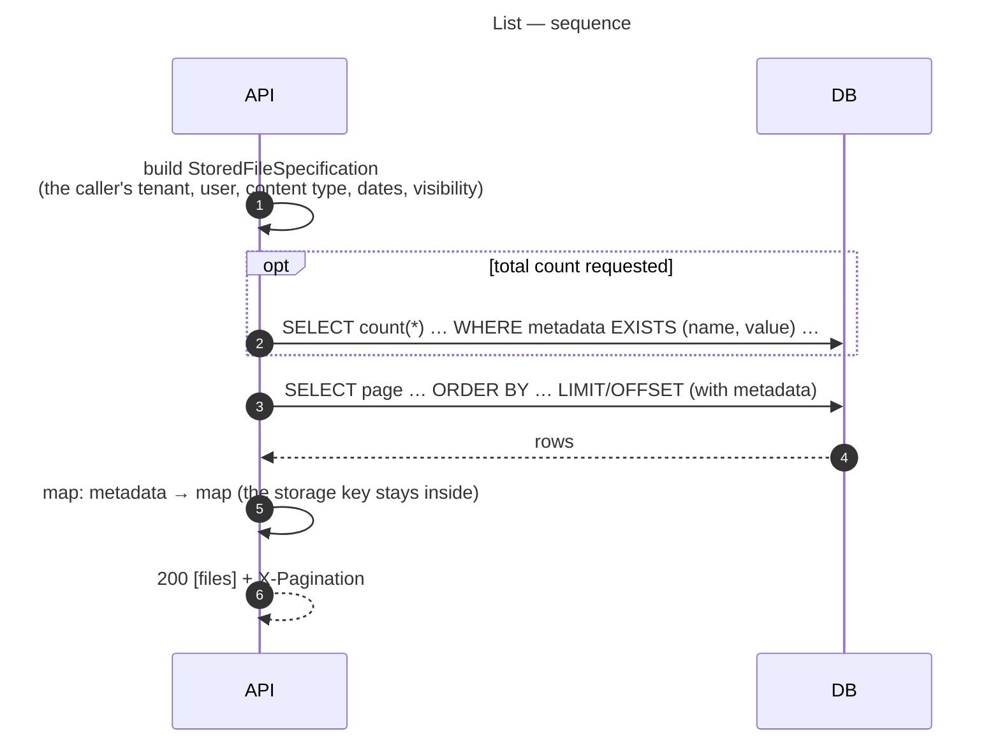
```mermaid
---
title: List — sequence
---
sequenceDiagram
    autonumber
    participant API
    participant DB

    API->>API: build StoredFileSpecification<br/>(the caller's tenant, user, content type, dates, visibility)
    opt total count requested
        API->>DB: SELECT count(*) … WHERE metadata EXISTS (name, value) …
    end
    API->>DB: SELECT page … ORDER BY … LIMIT/OFFSET (with metadata)
    DB-->>API: rows
    API->>API: map: metadata → map (the storage key stays inside)
    API-->>API: 200 [files] + X-Pagination
```

The tenant is always the caller's. Tenant and user filters are `EXISTS` sub-queries on `stored_file_metadata`, served by its `(name, value)` index.

## Details — sequence

`GET /api/v1/files/{id}?visibility=`

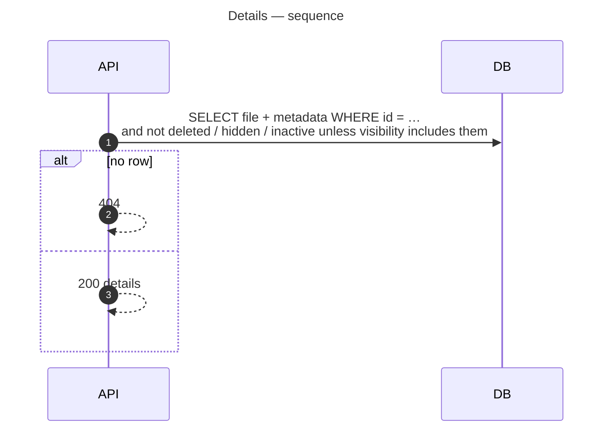
```mermaid
---
title: Details — sequence
---
sequenceDiagram
    autonumber
    participant API
    participant DB

    API->>DB: SELECT file + metadata WHERE id = … <br/>and not deleted / hidden / inactive unless visibility includes them
    alt no row
        API-->>API: 404
    else
        API-->>API: 200 details
    end
```

## Download — sequence

`GET /api/v1/files/{id}/content`

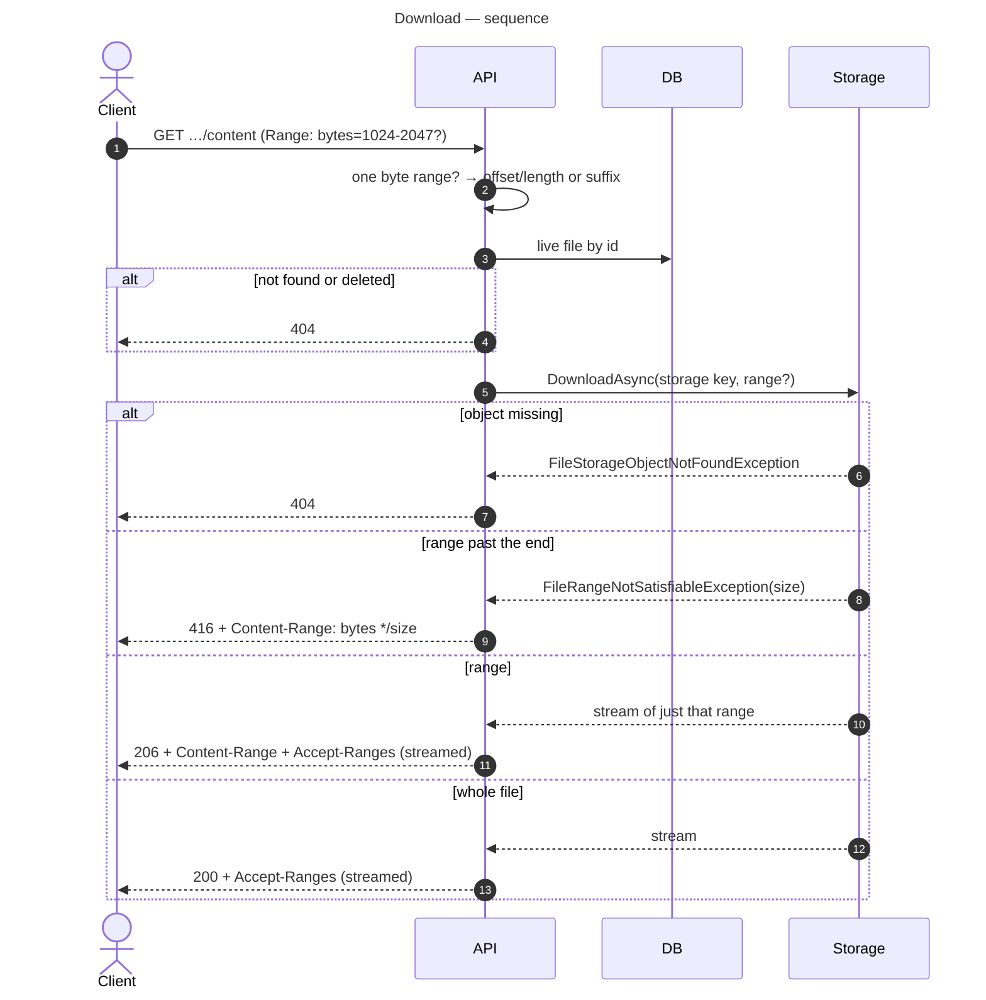
```mermaid
---
title: Download — sequence
---
sequenceDiagram
    autonumber
    actor C as Client
    participant API
    participant DB
    participant S as Storage

    C->>API: GET …/content (Range: bytes=1024-2047?)
    API->>API: one byte range? → offset/length or suffix
    API->>DB: live file by id
    alt not found or deleted
        API-->>C: 404
    end
    API->>S: DownloadAsync(storage key, range?)
    alt object missing
        S-->>API: FileStorageObjectNotFoundException
        API-->>C: 404
    else range past the end
        S-->>API: FileRangeNotSatisfiableException(size)
        API-->>C: 416 + Content-Range: bytes */size
    else range
        S-->>API: stream of just that range
        API-->>C: 206 + Content-Range + Accept-Ranges (streamed)
    else whole file
        S-->>API: stream
        API-->>C: 200 + Accept-Ranges (streamed)
    end
```

## Delete — sequence

`DELETE /api/v1/files/{id}`

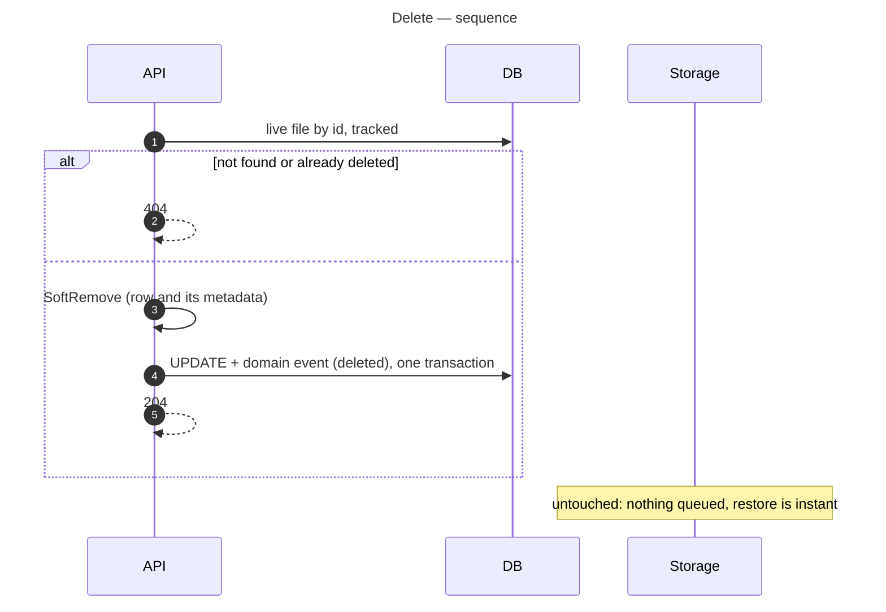
```mermaid
---
title: Delete — sequence
---
sequenceDiagram
    autonumber
    participant API
    participant DB
    participant S as Storage

    API->>DB: live file by id, tracked
    alt not found or already deleted
        API-->>API: 404
    else
        API->>API: SoftRemove (row and its metadata)
        API->>DB: UPDATE + domain event (deleted), one transaction
        API-->>API: 204
    end
    Note over S: untouched: nothing queued, restore is instant
```

## Restore — sequence

`POST /api/v1/files/{id}/restore`

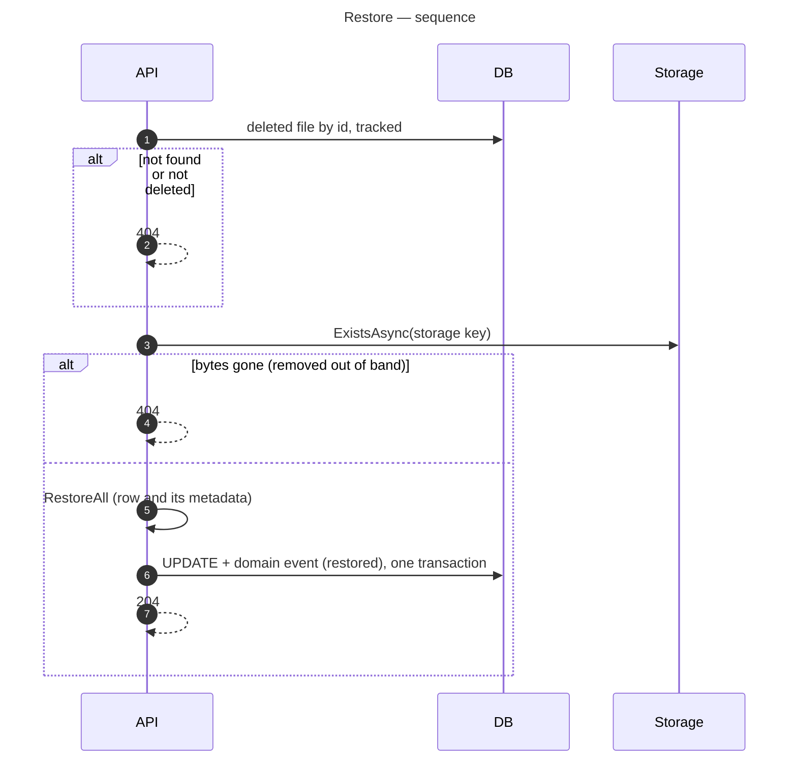
```mermaid
---
title: Restore — sequence
---
sequenceDiagram
    autonumber
    participant API
    participant DB
    participant S as Storage

    API->>DB: deleted file by id, tracked
    alt not found or not deleted
        API-->>API: 404
    end
    API->>S: ExistsAsync(storage key)
    alt bytes gone (removed out of band)
        API-->>API: 404
    else
        API->>API: RestoreAll (row and its metadata)
        API->>DB: UPDATE + domain event (restored), one transaction
        API-->>API: 204
    end
```

## Presign — sequence

`GET /api/v1/files/{id}/presign`

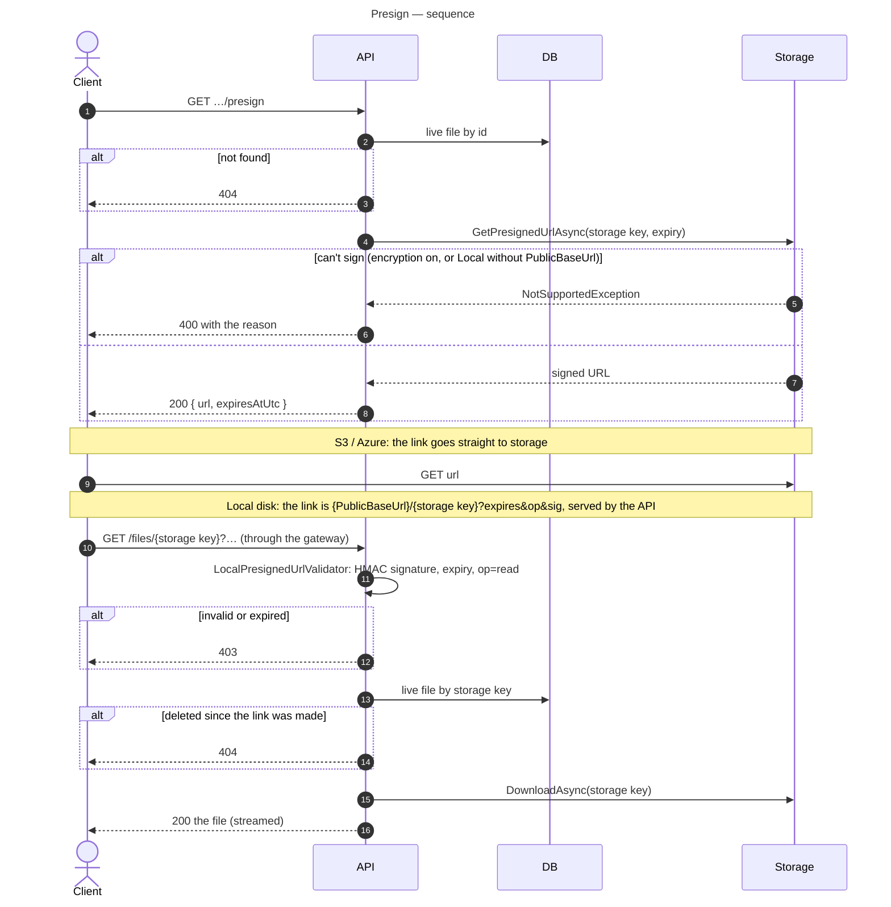
```mermaid
---
title: Presign — sequence
---
sequenceDiagram
    autonumber
    actor C as Client
    participant API
    participant DB
    participant S as Storage

    C->>API: GET …/presign
    API->>DB: live file by id
    alt not found
        API-->>C: 404
    end
    API->>S: GetPresignedUrlAsync(storage key, expiry)
    alt can't sign (encryption on, or Local without PublicBaseUrl)
        S-->>API: NotSupportedException
        API-->>C: 400 with the reason
    else
        S-->>API: signed URL
        API-->>C: 200 { url, expiresAtUtc }
    end

    Note over C,S: S3 / Azure: the link goes straight to storage
    C->>S: GET url

    Note over C,S: Local disk: the link is {PublicBaseUrl}/{storage key}?expires&op&sig, served by the API
    C->>API: GET /files/{storage key}?… (through the gateway)
    API->>API: LocalPresignedUrlValidator: HMAC signature, expiry, op=read
    alt invalid or expired
        API-->>C: 403
    end
    API->>DB: live file by storage key
    alt deleted since the link was made
        API-->>C: 404
    end
    API->>S: DownloadAsync(storage key)
    API-->>C: 200 the file (streamed)
```

## Encryption at rest — sequence

With `FileStorage:Encryption:Enabled`, `EncryptingFileStorageService` wraps the provider. Upload and download
look the same to the handlers.

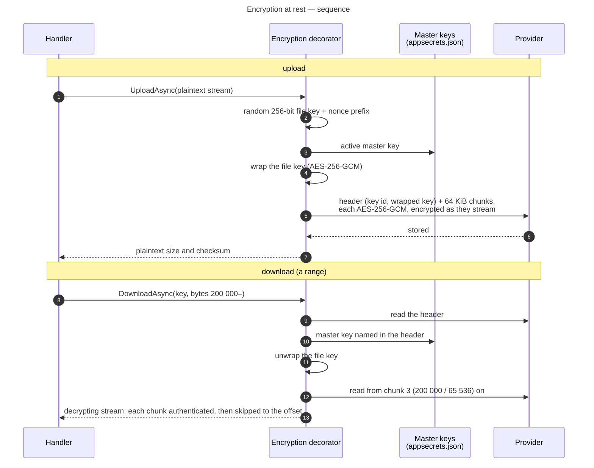
```mermaid
---
title: Encryption at rest — sequence
---
sequenceDiagram
    autonumber
    participant H as Handler
    participant E as Encryption decorator
    participant K as Master keys<br/>(appsecrets.json)
    participant P as Provider

    Note over H,P: upload
    H->>E: UploadAsync(plaintext stream)
    E->>E: random 256-bit file key + nonce prefix
    E->>K: active master key
    E->>E: wrap the file key (AES-256-GCM)
    E->>P: header (key id, wrapped key) + 64 KiB chunks,<br/>each AES-256-GCM, encrypted as they stream
    P-->>E: stored
    E-->>H: plaintext size and checksum

    Note over H,P: download (a range)
    H->>E: DownloadAsync(key, bytes 200 000–)
    E->>P: read the header
    E->>K: master key named in the header
    E->>E: unwrap the file key
    E->>P: read from chunk 3 (200 000 / 65 536) on
    E-->>H: decrypting stream: each chunk authenticated, then skipped to the offset
```

Any altered, reordered or truncated chunk fails authentication and the download errors instead of returning
wrong bytes.

## Storage cleanup — sequence

The worker, every minute.

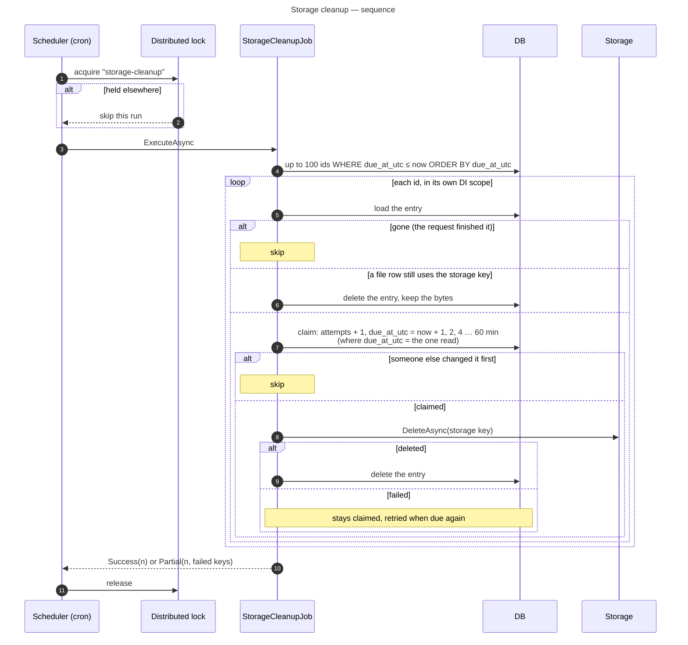
```mermaid
---
title: Storage cleanup — sequence
---
sequenceDiagram
    autonumber
    participant Q as Scheduler (cron)
    participant L as Distributed lock
    participant W as StorageCleanupJob
    participant DB
    participant S as Storage

    Q->>L: acquire "storage-cleanup"
    alt held elsewhere
        L-->>Q: skip this run
    end
    Q->>W: ExecuteAsync
    W->>DB: up to 100 ids WHERE due_at_utc ≤ now ORDER BY due_at_utc
    loop each id, in its own DI scope
        W->>DB: load the entry
        alt gone (the request finished it)
            Note over W: skip
        else a file row still uses the storage key
            W->>DB: delete the entry, keep the bytes
        else
            W->>DB: claim: attempts + 1, due_at_utc = now + 1, 2, 4 … 60 min<br/>(where due_at_utc = the one read)
            alt someone else changed it first
                Note over W: skip
            else claimed
                W->>S: DeleteAsync(storage key)
                alt deleted
                    W->>DB: delete the entry
                else failed
                    Note over W,DB: stays claimed, retried when due again
                end
            end
        end
    end
    W-->>Q: Success(n) or Partial(n, failed keys)
    Q->>L: release
```

Claiming by the `due_at_utc` concurrency token means the job and an upload slower than its 15-minute grace
period can't both act on one entry: whichever saves second fails and leaves it alone.

## Integrity check — sequence

The worker, every 5 minutes.

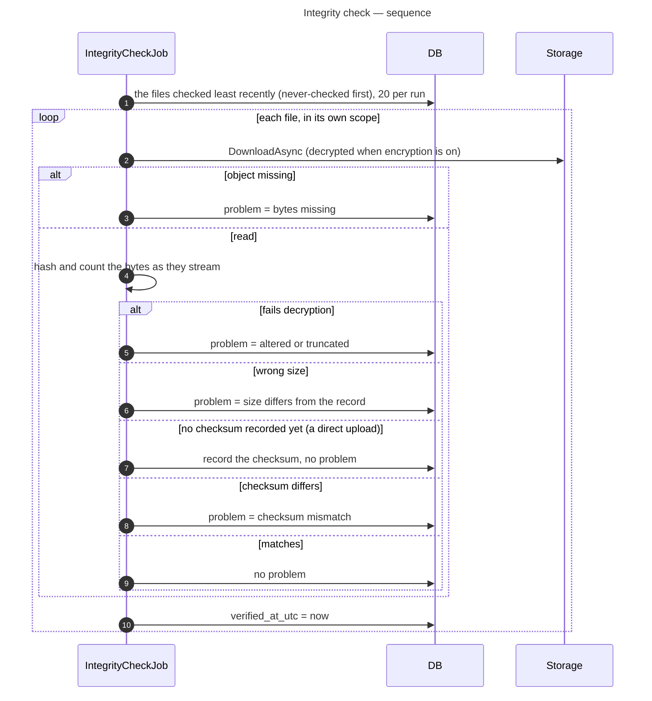
```mermaid
---
title: Integrity check — sequence
---
sequenceDiagram
    autonumber
    participant W as IntegrityCheckJob
    participant DB
    participant S as Storage

    W->>DB: the files checked least recently (never-checked first), 20 per run
    loop each file, in its own scope
        W->>S: DownloadAsync (decrypted when encryption is on)
        alt object missing
            W->>DB: problem = bytes missing
        else read
            W->>W: hash and count the bytes as they stream
            alt fails decryption
                W->>DB: problem = altered or truncated
            else wrong size
                W->>DB: problem = size differs from the record
            else no checksum recorded yet (a direct upload)
                W->>DB: record the checksum, no problem
            else checksum differs
                W->>DB: problem = checksum mismatch
            else matches
                W->>DB: no problem
            end
        end
        W->>DB: verified_at_utc = now
    end
```

A storage error that isn't a verdict on the bytes (the service didn't answer) records nothing, and the file is
tried again next run. Problems show as `integrityProblem` in details and the list, and the list filters on them.

## Retention — sequence

The worker, hourly.

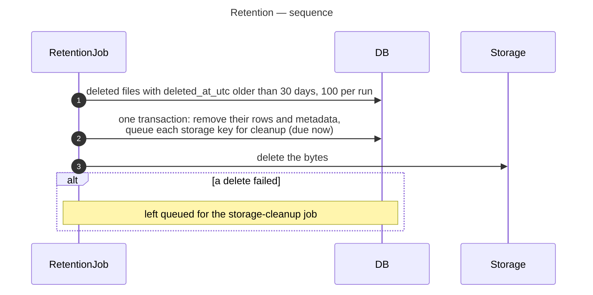
```mermaid
---
title: Retention — sequence
---
sequenceDiagram
    autonumber
    participant W as RetentionJob
    participant DB
    participant S as Storage

    W->>DB: deleted files with deleted_at_utc older than 30 days, 100 per run
    W->>DB: one transaction: remove their rows and metadata,<br/>queue each storage key for cleanup (due now)
    W->>S: delete the bytes
    alt a delete failed
        Note over W,DB: left queued for the storage-cleanup job
    end
```

`Retention:DeletedFileDays` set to 0 keeps deleted files forever.

## Health checks — sequence

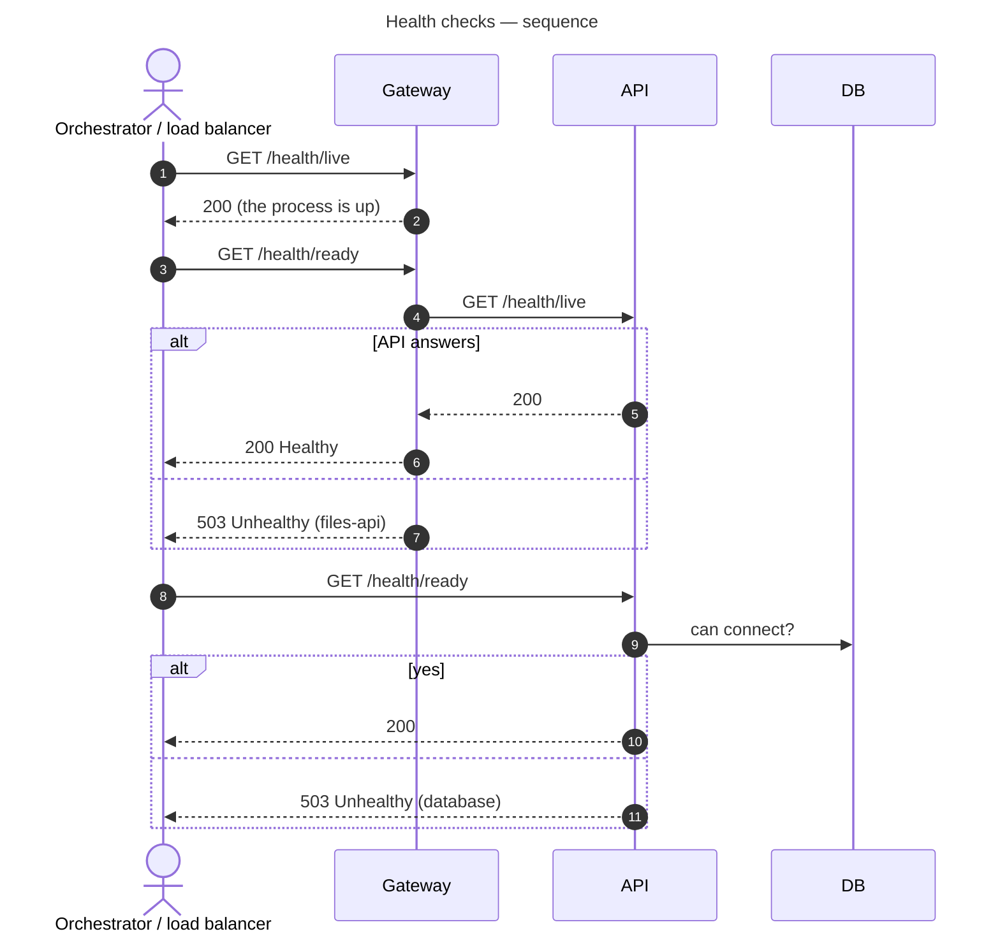
```mermaid
---
title: Health checks — sequence
---
sequenceDiagram
    autonumber
    actor O as Orchestrator / load balancer
    participant G as Gateway
    participant API
    participant DB

    O->>G: GET /health/live
    G-->>O: 200 (the process is up)

    O->>G: GET /health/ready
    G->>API: GET /health/live
    alt API answers
        API-->>G: 200
        G-->>O: 200 Healthy
    else
        G-->>O: 503 Unhealthy (files-api)
    end

    O->>API: GET /health/ready
    API->>DB: can connect?
    alt yes
        API-->>O: 200
    else
        API-->>O: 503 Unhealthy (database)
    end
```

The gateway's health routes are its own, not forwarded. The API's are reached directly, not through the gateway.

## Swagger via gateway — sequence

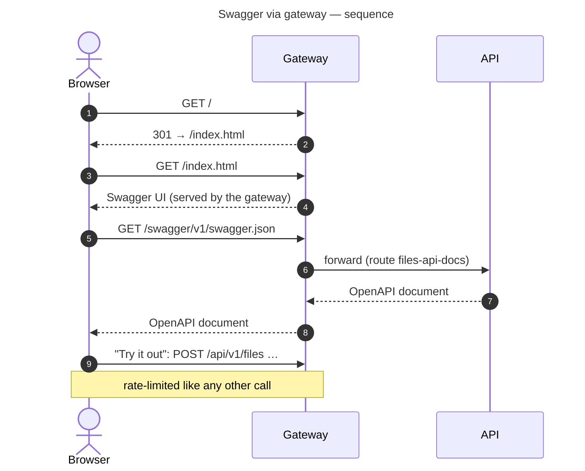
```mermaid
---
title: Swagger via gateway — sequence
---
sequenceDiagram
    autonumber
    actor B as Browser
    participant G as Gateway
    participant API

    B->>G: GET /
    G-->>B: 301 → /index.html
    B->>G: GET /index.html
    G-->>B: Swagger UI (served by the gateway)
    B->>G: GET /swagger/v1/swagger.json
    G->>API: forward (route files-api-docs)
    API-->>G: OpenAPI document
    G-->>B: OpenAPI document
    B->>G: "Try it out": POST /api/v1/files …
    Note over B,G: rate-limited like any other call
```
